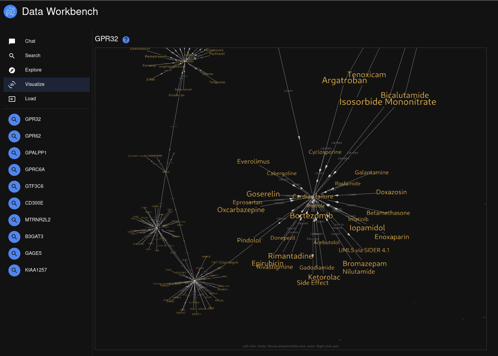
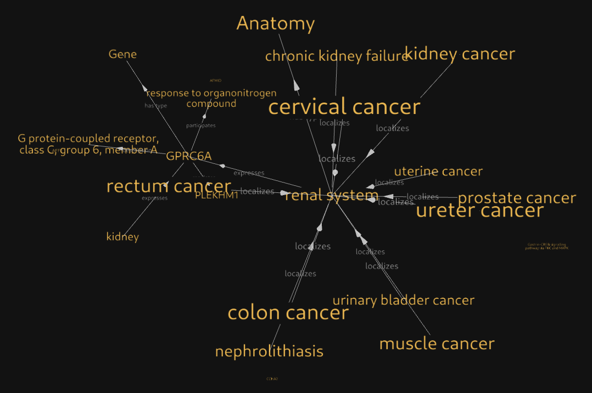

# Hetionet loader for TrustGraph

This is a script which relies on having:
- Python3 and some libraries: json-stream, fastembed, aiohttp
- A running TrustGraph
- Installed trustgraph-base package

## Loading the data

Download and process...

```
wget 'https://github.com/hetio/hetionet/raw/refs/heads/main/hetnet/json/hetionet-v1.0.json.bz2'
./hetionet-load -i hetionet-v1.0.json.bz2 -v
```

## Working with the data

### GraphRAG example

```
 tg-invoke-graph-rag  -e 50 -t 30 -s 1500 -p 2 -q 'Tell me about G-protein coupled purinergic nucleotide receptor actvity'
```

Response:
```
Based on the provided information, we can say that several genes and proteins
are involved in G-protein coupled receptor activity. 

Here's what we know:

* **OR10A2** is mentioned as participating in "GPCRs, Other". While this
  doesn't explicitly state purinergic nucleotide receptors, it suggests
  a role in GPCR signaling pathways.
* **CHRM1** is listed as participating in "G-protein coupled receptor
  activity". 
* **NMT1** regulates NAGLU, and NAGLU participates in vacuolar lumen.
  While not directly linked to purinergic receptors, this connection hints
  at potential regulatory pathways.

**However,** the provided data does **not** offer specific details about
G-protein coupled *purinergic nucleotide receptor* activity. 

To learn more about that specific type of receptor, you'd need to consult
additional sources beyond these statements.
```

### Knowledge graph views




